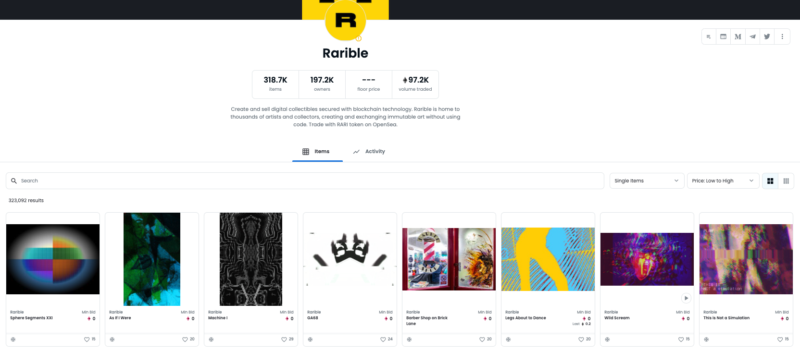

# Collections and Smart Contracts

### Overview

In the world of NFTs, each NFT collection and its parameters/features are defined by a **smart contract**. A smart contract is a program stored on a blockchain that will execute when predetermined conditions are met. **Simply put, smart contracts equal blockchain code**. NFT collections with features like randomization, burn mechanics, dynamic content, etc. are all defined by blocks of code that people write in each collection's respective smart contract. 

### Why Does this Matter?

The beauty of NFTs is in its interoperability. This means applications (marketplaces, metaverses, galleries) can integrate easily with NFTs. And how these apps filter NFTs is via the smart contracts that define each NFT collection. Metaphorically, each smart contract is a [book and all the NFTs are the pages in it]. Naturally speaking, each creator would want their own book (smart contract) because their NFTs tell a unique, individual story. But, this is not always the case. Many free minting platforms today offer a shared contract - meaning your NFTs will sit alongside other creators' NFTs in the eyes of all other blockchain applications. 

### The Irony of Shared Contracts

NFTs are all about provenance, ownership, and individuality and you lose all that with a shared contract. Rarible, a popular secondary marketplace, allows you to mint and sell NFTs for free using a shared contract. As a result, **all applications will read this contract as one, despite the thousands of creators and hundreds of thousands of NFTs within this contract.** There is no way for a creator to tag their NFTs in a shared contract. Any additional NFT on Rarible will be the same type and will just be 1 of 320,000 NFTs in this collection (the same is true using an OpenSea shared contract). This is the proverbial "I don't want my NFTs next to a bunch of d*ck pics" problem creators hope to avoid. 

### Bespoke Contracts: The Easely Way

"Why would anyone ever use a shared contract?" you may ask