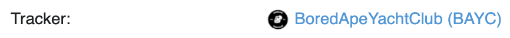

# Standard Collection

### Overview

Standard collections are custom contracts that let creators create NFTs with provenance on the blockchain. Creators can create custom contracts for cheap using Easely and with no code, while still retaining all the benefits of having their own contract. Standard collections can mint and sell unlimited NFTs of any file type and cost the fraction of a traditional smart contract due to Easely's contract factory. 

### Collection Name

The `collection name` is a creator's first mark on the blockchain and its importance cannot be understated. It defines the entire collection and all the NFTs within the collection. Since other applications interact with NFTs via their smart contract, the collection name is essentially the title for each contract. Examples of collection names are CRYPTOPUNKS and BoredApeYachClub.

### Token Symbol

All NFTs within a collection/smart contract are denoted by a common `token symbol`. Token symbols are often shortened variations of collection names or acronyms, similar to a stock ticker. For example "Ͼ" is the token symbol for CRYPTOPUNKS and "BAYC" is the token symbol for BoredApeYachtClub. 

It is important to note that the `collection name` and `token symbol` act as the `Tracker` heading on Etherscan like the below.

### Secondary Royalty

`Secondary royalty` is the cut that the creator continues to take for every secondary transaction after the primary sale to a buyer. Our contract treats royalties in line with the Ethereum NFT Royalty Standard (EIP-2981). But, it is important to note that EIP-2981 is not universally acknowledged yet - most marketplaces (e.g. OpenSea and Rarible) will have their own off-chain royalty system that only the owner of each contract can control. **Thus, despite setting a royalty % on Easely's platform, all creators should still go on to each marketplace and set a royalty for their collection (custom smart contract)**. Easely creators are able to do this because they own their custom smart contracts. 

### Revenue Share

`Revenue share` represents the additional wallets and percentages you would like to split revenue with for all NFT sales within the collection (e.g. charitable donations, collaborations, etc). Every additional wallet increases the gas fee for the end buyer by a non-trivial amount and should only be used when absolutely necessary.

Please note that this is separate from Easely's 5% platform fee for any NFTs sold via Easely's platform. Example in which an additional wallet is given 10% revenue share: 

| Wallet            | Royalty (%) |
| ----------------- | ----------- |
| Creator Wallet    | 85          |
| Rev Share Wallet  | 10          |
| Easely            | 5           |
| **Total**         | **100**     |

### Single NFTs

NFTs will take in [    ]