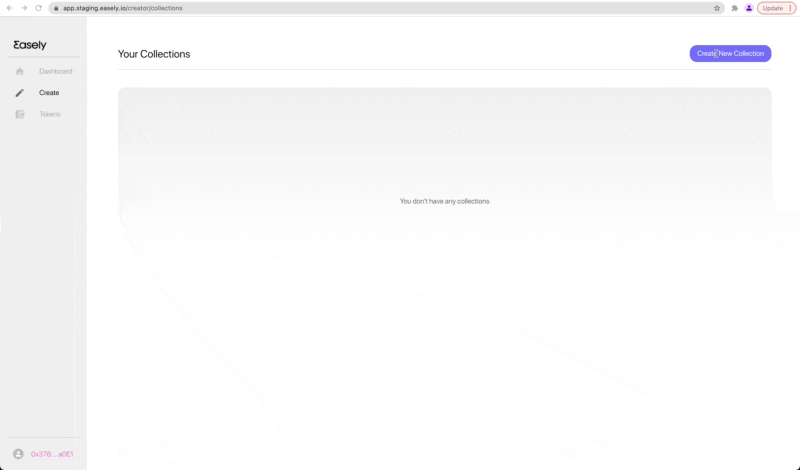

# Creating a Standard Collection

This tutorial walks through setting up a standard collection on TestNet, creating a NFT, selling the NFT on your own website, and managing secondary sales. 

Create your account on [Easely's TestNet platform](https://rinkeby.app.easely.io/) and login. Navigate to the `Create` tab on the sidebar. From there, click `Create New Collection` on the right, choose `Standard Collection` and complete the fields. You can find detailed docs for each standard collection parameter [here](http://localhost:3000/docs/collections-and-features/std-collection). 

